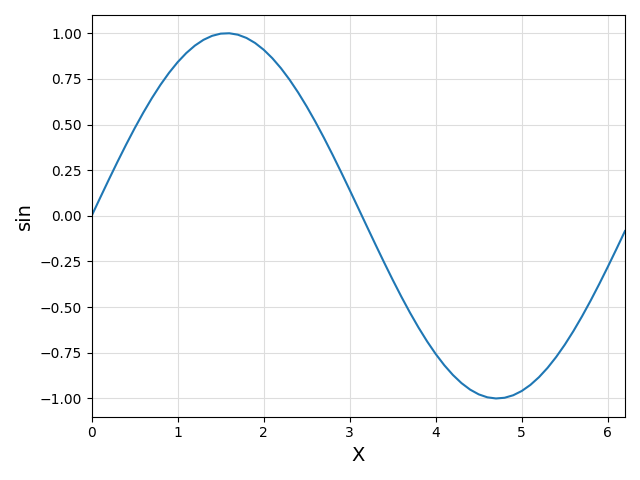
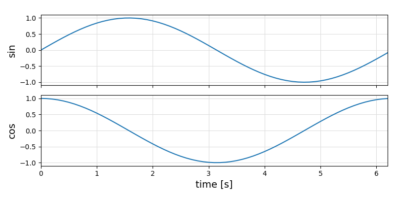

# ControlPlots

[](https://github.com/aenarete/ControlPlots.jl/actions/workflows/CI.yml?query=branch%3Amain)

## Introduction

This package provides the following features:

- the parameters of the plot commands are stored in a struct and returned
- this struct can be displayed again or stored in a file and loaded later
- an oscilloscope-like plot with multiple channels can be created
  with the `plotx()` function
- an XY plot can be created with the `plotxy()` function

## TODO
- add support for PythonPlot
- allow changing of the caption
- the `save()` function should allow storing a plot as jld2, pdf or png file
- add bode plots

## Installation
### On Linux
First, install matplotlib:
```bash
sudo apt install python3-matplotlib
```
If not done yet, create a project:
```bash
mkdir MyProject
cd MyProject
julia --project="."
```
and install `ControlPlots`
```julia
using Pkg
pkg"add ControlPlots"
```

### On Windows
If not done yet, create a project:
```bash
mkdir MyProject
cd MyProject
julia --project="."
```
Install Python, matplotlib and ControlPlots
```
using Pkg
ENV["PYTHON"]=""
pkg"add ControlPlots"
```

## Usage

### Basic example
Launch Julia with `julia --project`. Then execute:
```julia
using ControlPlots

X = 0:0.1:2pi
Y = sin.(X)
p = plot(X, Y, xlabel="X", ylabel="sin", fig="basic")
```
A plot window like this should pop up:
<p align="center"></p>

You can now close the plot window.
You can re-display the plot by typing:
```julia
p
```
You can also save the plot under a name of your choice:
```julia
save("plot.jld2", p)
```
Now you restart Julia and load it with:
```julia
p = load("plot.jld2")
```
The plot is automatically displayed.

### Multi-channel plot
```julia
using ControlPlots

T = 0:0.1:2pi
Y1 = sin.(T)
Y2 = cos.(T)
p = plotx(T, Y1, Y2; ylabels=["Y1", "Y2"], fig="dual")
```
<p align="center"></p>

### XY-Plot
```julia
using ControlPlots

T = 0:0.1:2pi+0.1
X = sin.(T)
Y = cos.(T)
p = plotxy(X, Y, xlabel="X", ylabel="Y", fig="xy")
```

### n-in-one Plot
You can plot multiple time series in one plot, e.g. like this:
```julia
using ControlPlots

x   = 1.5*ones(11)
y   = 1:0.1:2
out = min.(x, y)
plot(1:11, [x, y, out]; labels=["input_a", "input_b", "output"], fig="2-in-one")
```
