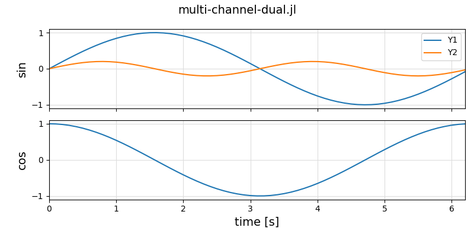
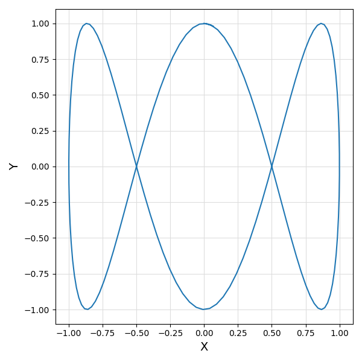
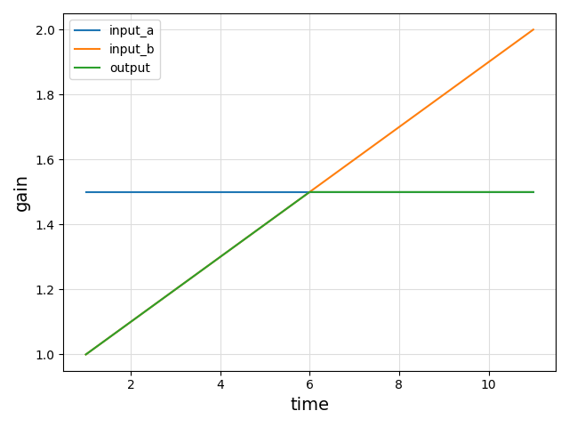
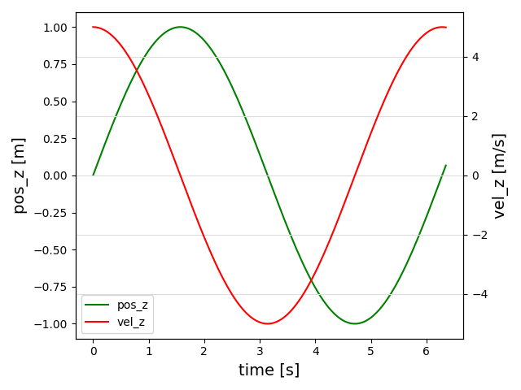
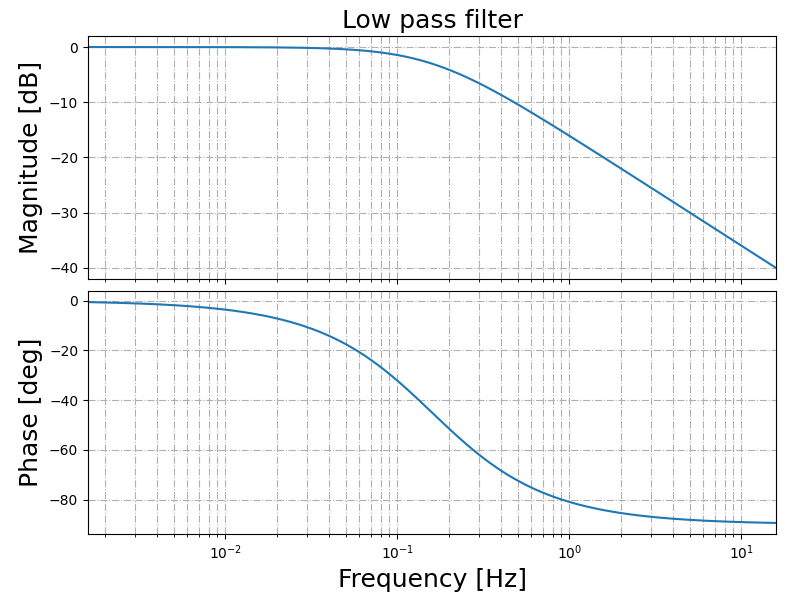

# ControlPlots

[](https://github.com/aenarete/ControlPlots.jl/actions/workflows/CI.yml?query=branch%3Amain)
[](https://github.com/JuliaTesting/Aqua.jl)

## Introduction

This package provides the following features:

- simple plots can be created with the `plot()` function
- an oscilloscope-like plot with multiple channels can be created
  with the `plotx()` function
- an XY plot can be created with the `plotxy()` function
- the `plot2d` function can create fast animations of particle systems, connected with segments
- bode plots using the `bode_plot()` function
- pan and zoom are supported
- LaTeX can be used for the labels
- the parameters of the plot commands are stored in a struct and returned
- this struct can be displayed again or stored in a file and loaded, the labels etc can be edited and a new plot can be displayed or exported

<details>
  <summary>Planned features</summary>

## TODO
- add support for PythonPlot
- the `save()` function should allow storing a plot as jld2, pdf or png file
</details>

The goal of this package is to provide simple plots for control system developers and students.


## Installation
<details>
  <summary>Installation on Linux</summary>
  
### On Linux
First, install matplotlib:
```bash
sudo apt install python3-matplotlib
```
If not done yet, create a project:
```bash
mkdir MyProject
cd MyProject
julia --project="."
```
and install `ControlPlots`
```julia
using Pkg
pkg"add ControlPlots"
```
  
</details>
<details>
  <summary>Installation on Windows</summary>

### On Windows
If not done yet, create a project:
```bash
mkdir MyProject
cd MyProject
julia --project="."
```
Install Python, matplotlib and ControlPlots
```
using Pkg
ENV["PYTHON"]=""
pkg"add ControlPlots"
```
</details>

## Usage
### Basic example
Launch Julia with `julia --project`. Then execute:
```julia
using ControlPlots, LaTeXStrings

X = 0:0.1:2pi
Y = sin.(X)
p = plot(X, Y, xlabel=L"\alpha = [0..2\pi]", ylabel="sin", fig="basic")
```
A plot window like this should pop up:
<p align="center"></p>

The package `LaTeXStrings` is only required if you want to use LaTeX for any of your labels like in the example above. You need to prefix LaTeX strings with the letter `L`.

You can now close the plot window.
You can re-display the plot by typing:
```julia
p
```
You can also save the plot under a name of your choice:
```julia
save("plot.jld2", p)
```
Now you restart Julia and load it with:
```julia
using ControlPlots
p = load("plot.jld2")
```
The plot is automatically displayed.

Full function signature:
```julia
plot(X, Ys::AbstractVector{<:Union{AbstractVector, Tuple}}; xlabel="", ylabel="", labels=nothing,
     xlims=nothing, ylims=nothing, ann=nothing, scatter=false, title="", fig="", ysize=14, disp=false)
```

### Running the examples
Create a project folder and start Julia:
```bash
mkdir examples
cd examples
julia --project=.
```
Add the package, and install and run the examples:
```julia
using Pkg
pkg"add ControlPlots"
using ControlPlots
ControlPlots.install_examples()
include("examples/menu.jl")
```
You should now see a menu with all the examples. Select one by using the \<UP\> and \<DOWN\> keys and press \<ENTER\> to run the example.

### Multi-channel plot
```julia
using ControlPlots

T = 0:0.1:2pi
Y1 = sin.(T)
Y2 = cos.(T)
p = plotx(T, Y1, Y2; ylabels=["Y1", "Y2"], fig="dual")
```
<p align="center"></p>

Full function signature:
```julia
plotx(X, Y...; xlabel="time [s]", ylabels=nothing, labels=nothing, xlims=nothing, ylims=nothing, ann=nothing, 
               scatter=false, fig="", title="", ysize=14, yzoom=1.0, disp=false)
```
The optional parameter `ysize` can be used to change the size of the y-axis labels. The default value is 14 points.

### **n x m** Plot
You can put more than one time series in one or more of the vertically aligned plots, shown before.
This is for example useful for combining set value and actual value of a signal in one plot.

```julia
using ControlPlots

T = 0:0.1:2pi
Y1 = sin.(T)
Y2 = 0.2*sin.(2T)
Y = cos.(T)
plotx(T, [Y1, Y2], Y; ylabels=["sin","cos"], labels=[["Y1","Y2"]], 
        fig="multi-channel-dual", title="multi-channel-dual.jl")
```
It is sufficient to pass one or more vectors of time series to the `plotx` function. In this case the labels have to be a vector of vectors.
<p align="center"></p>

### XY-Plot
```julia
using ControlPlots

T = 0:0.05:2pi+0.1
X = sin.(T)
Y = cos.(3T)
p = plotxy(X, Y, xlabel="X", ylabel="Y", fig="xy")
```
<p align="center"></p>

### n-in-one Plot
You can plot multiple time series in one plot, e.g. like this:
```julia
using ControlPlots

x   = 1.5*ones(11)
y   = 1:0.1:2
out = min.(x, y)
plot(1:11, [x, y, out]; labels=["input_a", "input_b", "output"], 
     fig="2-in-one")
```
<p align="center"></p>

### Dual y-axis
```julia
using ControlPlots

T = 0:0.05:2pi+0.1
POS_Z = sin.(T)
VEL_Z = 5*cos.(T)
plot(T, POS_Z, VEL_Z; xlabel="time [s]", 
     ylabels=["pos_z [m]", "vel_z [m/s]"], 
     labels=["pos_z", "vel_z"], fig="dual_y-axis")
```
<p align="center"></p>

### Bode plot
```julia
using ControlSystemsBase
using ControlPlots

P = tf([1.], [1., 1])

bode_plot(P; from=-2, to=2, title="Low pass filter")
```
<p align="center"></p>

Full function signature:
```julia
bode_plot(sys::Union{StateSpace, TransferFunction}; title="", from=-3, to=1, fig=true, 
          db=true, hz=true, bw=false, linestyle="solid", title="", show_title=true, fontsize=18)
```
For using this function you need to do `using ControlSystemsBase` first, because this is a package extension.

### 2D video
A video-like display of a particle system (points, connected by lines) can be created with the 
function `plot2d`. Example:
```julia
using ControlPlots

t = 0
x0 = 2.0
z0 = 0.0
for t in 0:0.1:5
    global x0, z0
    plot2d([[1,0,0], [x0,0,z0]], t; segments=1)
    x0 += 0.1; z0 += 0.1
    sleep(0.1)
end
``` 
When the function is called at t=0 the line, dot and text objects are created. Each time afterwords these
objects are just moved/ updated. Therefore, the update is very fast and you can achieve a high frame rate.
With 10 points you can achieve a framerate of 20 Hz or more, depending on the speed of your hardware.

## 2D video with custom segments
You can create 2D animations with custom line segments between points. Example:
```julia
using ControlPlots

for t in 0:0.05:5
    # Define points for triangle
    points = [
        [t, 0, 2.0],           # top
        [t-0.5, 0, 1.0],       # bottom left
        [t+0.5, 0, 1.0]        # bottom right
    ]
    
    # Define segments to connect points
    segments = [
        [1, 2],  # top to bottom left
        [2, 3],  # bottom left to right
        [3, 1]   # bottom right to top
    ]
    
    # Plot the triangle
    plot2d(points, segments, t; zoom=false, xlim=(0, 5), ylim=(0, 3))
    sleep(0.05)
end
```
This creates a moving triangle animation. The `segments` parameter defines which points should be connected by lines, making it easy to create shapes and animations. Each segment is defined by a pair of indices referring to points in the `points` array.

### Advanced usage
This library uses Matplotlib as backend, and you can change all settings of [rcParams](https://matplotlib.org/stable/users/explain/customizing.html#matplotlibrc-sample) as you wish. Example: Using an already installed LaTeX installation for high-quality rendering of LaTeX labels and other text:

#### More beautiful LaTeX
```julia
rcParams = plt.PyDict(plt.matplotlib."rcParams")
rcParams["text.usetex"] = true
```
Just add this at the beginning of your script. You can change fonts, font sizes, colors etc.

#### More beautiful GUI
If you add the following line to your `.bashrc` file or to the script you use to start Julia:
```bash
export MPLBACKEND=qt5agg
```
you get a more beautiful GUI. This does not work on every PC, therefore it is not the default.