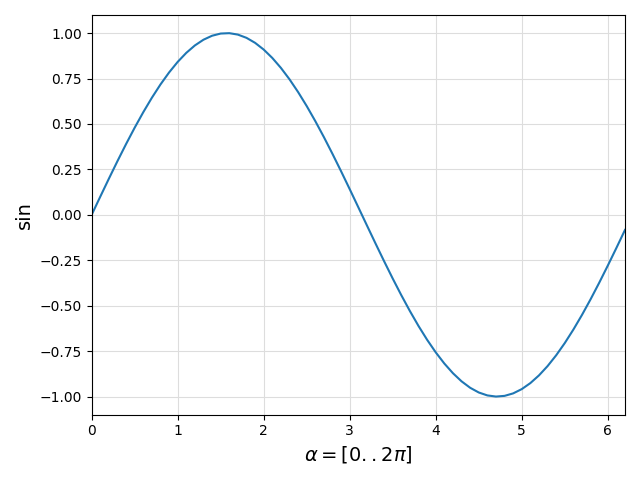

# ControlPlots

[](https://github.com/aenarete/ControlPlots.jl/actions/workflows/CI.yml?query=branch%3Amain)

## Introduction

This package provides the following features:

- simple plots can be created with the `plot()` function
- an oscilloscope-like plot with multiple channels can be created
  with the `plotx()` function
- an XY plot can be created with the `plotxy()` function
- pan and zoom are supported
- LaTeX can be used for the labels
- the parameters of the plot commands are stored in a struct and returned
- this struct can be displayed again or stored in a file and loaded, the labels etc can be edited and a new plot can be displayed or exported

<details>
  <summary>Planned features</summary>

## TODO
- add support for PythonPlot
- allow changing of the caption
- the `save()` function should allow storing a plot as jld2, pdf or png file
- add bode plots
</details>

The goal of this package is to provide simple plots for control system developers and students.


## Installation
<details>
  <summary>Installation on Linux</summary>
  
### On Linux
First, install matplotlib:
```bash
sudo apt install python3-matplotlib
```
If not done yet, create a project:
```bash
mkdir MyProject
cd MyProject
julia --project="."
```
and install `ControlPlots`
```julia
using Pkg
pkg"add ControlPlots"
```
  
</details>
<details>
  <summary>Installation on Windows</summary>

### On Windows
If not done yet, create a project:
```bash
mkdir MyProject
cd MyProject
julia --project="."
```
Install Python, matplotlib and ControlPlots
```
using Pkg
ENV["PYTHON"]=""
pkg"add ControlPlots"
```
</details>

## Usage

### Basic example
Launch Julia with `julia --project`. Then execute:
```julia
using ControlPlots, LaTeXStrings

X = 0:0.1:2pi
Y = sin.(X)
p = plot(X, Y, xlabel=L"\alpha = [0..2\pi]", ylabel="sin", fig="basic")
```
A plot window like this should pop up:
<p align="center"></p>

The package `LaTeXStrings` is only required if you want to use LaTeX for any of your labels like in the example above. You need to prefix LaTeX strings with the letter `L`.

You can now close the plot window.
You can re-display the plot by typing:
```julia
p
```
You can also save the plot under a name of your choice:
```julia
save("plot.jld2", p)
```
Now you restart Julia and load it with:
```julia
using ControlPlots
p = load("plot.jld2")
```
The plot is automatically displayed.

### Multi-channel plot
```julia
using ControlPlots

T = 0:0.1:2pi
Y1 = sin.(T)
Y2 = cos.(T)
p = plotx(T, Y1, Y2; ylabels=["Y1", "Y2"], fig="dual")
```
<p align="center"></p>
The optional parameter `ysize` can be used to change the size of the y-axis labels. The default value is 14 points.

### XY-Plot
```julia
using ControlPlots

T = 0:0.05:2pi+0.1
X = sin.(T)
Y = cos.(3T)
p = plotxy(X, Y, xlabel="X", ylabel="Y", fig="xy")
```
<p align="center"></p>

### n-in-one Plot
You can plot multiple time series in one plot, e.g. like this:
```julia
using ControlPlots

x   = 1.5*ones(11)
y   = 1:0.1:2
out = min.(x, y)
plot(1:11, [x, y, out]; labels=["input_a", "input_b", "output"], 
     fig="2-in-one")
```
<p align="center"></p>

### Dual y-axis
```julia
using ControlPlots

T = 0:0.05:2pi+0.1
POS_Z = sin.(T)
VEL_Z = 5*cos.(T)
plot(T, POS_Z, VEL_Z; xlabel="time [s]", 
     ylabels=["pos_z [m]", "vel_z [m/s]"], 
     labels=["pos_z", "vel_z"], fig="dual_y-axis")
```
<p align="center"></p>

### Advanced usage
This library uses Matplotlib as backend, and you can change all settings of [rcParams](https://matplotlib.org/stable/users/explain/customizing.html#matplotlibrc-sample) as you wish. Example: Using an already installed LaTeX installation for high-quality rendering of LaTeX labels and other text:

#### More beautiful LaTeX
```julia
rcParams = plt.PyDict(plt.matplotlib."rcParams")
rcParams["text.usetex"] = true
```
Just add this at the beginning of your script. You can change fonts, font sizes, colors etc.

#### More beautiful GUI
If you add the following line to your `.bashrc` file or to the script you use to start Julia:
```bash
export MPLBACKEND=qt5agg
```
you get a more beautiful GUI. This does not work on every PC, therefore it is not the default.